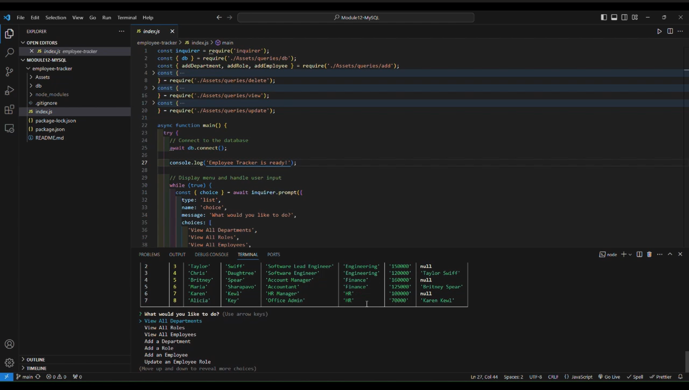

# 12 SQL: Employee Tracker

## My Task

Developers frequently have to create interfaces that allow non-developers to easily view and interact with information stored in databases. These interfaces are called **content management systems (CMS)**. My assignment this week is to build a command-line application from scratch to manage a company's employee database, using Node.js, Inquirer, and MySQL.

Because this Challenge will require the use of the `Inquirer` package, ensure that you(users) install and use Inquirer version 8.2.4. To do so, use the following command in the unzipped downloaded repo: `npm i inquirer@8.2.4`.

Because this application won’t be deployed, I’ll also need to create a walkthrough video that demonstrates its functionality and all of the following acceptance criteria being met. I’ll need to submit a link to the video and add it to the README of my project.

## User Story

```md
AS A business owner
I WANT to be able to view and manage the departments, roles, and employees in my company
SO THAT I can organize and plan my business
```

## Acceptance Criteria

```md
GIVEN a command-line application that accepts user input
WHEN I start the application
THEN I am presented with the following options: view all departments, view all roles, view all employees, add a department, add a role, add an employee, and update an employee role
WHEN I choose to view all departments
THEN I am presented with a formatted table showing department names and department ids
WHEN I choose to view all roles
THEN I am presented with the job title, role id, the department that role belongs to, and the salary for that role
WHEN I choose to view all employees
THEN I am presented with a formatted table showing employee data, including employee ids, first names, last names, job titles, departments, salaries, and managers that the employees report to
WHEN I choose to add a department
THEN I am prompted to enter the name of the department and that department is added to the database
WHEN I choose to add a role
THEN I am prompted to enter the name, salary, and department for the role and that role is added to the database
WHEN I choose to add an employee
THEN I am prompted to enter the employee’s first name, last name, role, and manager, and that employee is added to the database
WHEN I choose to update an employee role
THEN I am prompted to select an employee to update and their new role and this information is updated in the database
```

## Mock-Up

The following video shows an example of the application being used from the command line:

[](https://1drv.ms/v/s!AhjTQobLPW72riLZgoozemYxrp4g)

## Getting Started

I’ll need to use the [MySQL2 package](https://www.npmjs.com/package/mysql2) to connect to my MySQL database and perform queries, and the [Inquirer package](https://www.npmjs.com/package/inquirer/v/8.2.4) to interact with the user via the command line.

The database schema is designed as shown in the following image:


As the image illustrates, your schema should contain the following three tables:

- `department`

  - `id`: `INT PRIMARY KEY`

  - `name`: `VARCHAR(30)` to hold department name

- `role`

  - `id`: `INT PRIMARY KEY`

  - `title`: `VARCHAR(30)` to hold role title

  - `salary`: `DECIMAL` to hold role salary

  - `department_id`: `INT` to hold reference to department role belongs to

- `employee`

  - `id`: `INT PRIMARY KEY`

  - `first_name`: `VARCHAR(30)` to hold employee first name

  - `last_name`: `VARCHAR(30)` to hold employee last name

  - `role_id`: `INT` to hold reference to employee role

  - `manager_id`: `INT` to hold reference to another employee that is the manager of the current employee (`null` if the employee has no manager)

## Notes

- [The URL of the walkthtough video of the application.](https://1drv.ms/v/s!AhjTQobLPW72riLZgoozemYxrp4g)

- [The URL of the GitHub repository, with a unique name and a README describing the project.](https://github.com/BadrulBorhanudin/employee-tracker)
